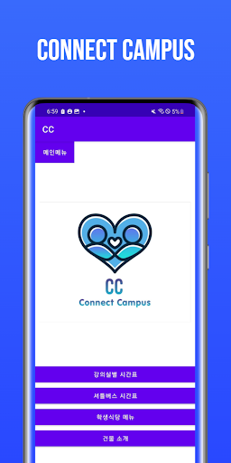
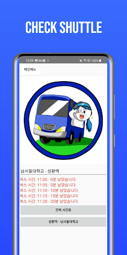
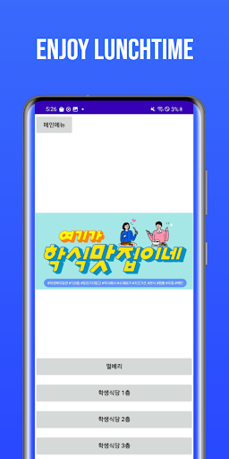
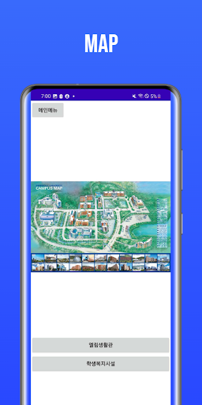
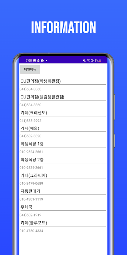

## ⭐️ **** Project

---

# 🏫 남서울대학교 재학생들을 위한 애플리케이션 CC

## 💡 프로젝트 소개 [졸업작품]

CC 애플리케이션은 학생들의 캠퍼스 라이프를 더욱 편리하게 만들어주는 올인원 솔루션입니다. 셔틀버스 실시간 정보, 강의실 안내, 맛있는 식단 정보까지 - 모든 것을 손끝으로 확인하세요! 🚀

### 📱 스크린샷

    
    
    
    
    

# 🛸 TECH STACKS

| Language | Java 11 |
| --- | --- |
| Framework | java API Framework |
| Minimum SDK | API 33 : Android Tiramisu |
| Target SDK | API 34 |

## ✨ 주요기능

### 📚 강의실별 시간표

- **기능**: 실시간 강의실 시간표 조회 시스템
- **설명**: 원하는 강의실의 주간 일정을 한눈에 확인할 수 있습니다

### 🚌 셔틀버스 시간표

- **기능**: 실시간 셔틀버스 정보 제공
- **설명**: 노선별 실시간 운행 정보와 도착 예정 시간을 확인할 수 있습니다

### 🍽️ 학생식당 메뉴

- **기능**: 일일 메뉴 실시간 업데이트
- **설명**: 오늘의 메뉴와 가격을 한눈에 확인할 수 있습니다

### 🏢 건물 정보

- **기능**: 캠퍼스 내 건물 위치 안내
- **설명**: 건물 정보와 함께 최적의 경로를 안내해드립니다

## 📬 기여하기

여러분의 소중한 의견으로 더 나은 CC를 만들어갑니다! 아래 연락처로 피드백을 보내주세요

- **📧 이메일**: [disney1026@naver.com], [yjc7241@naver.com]
